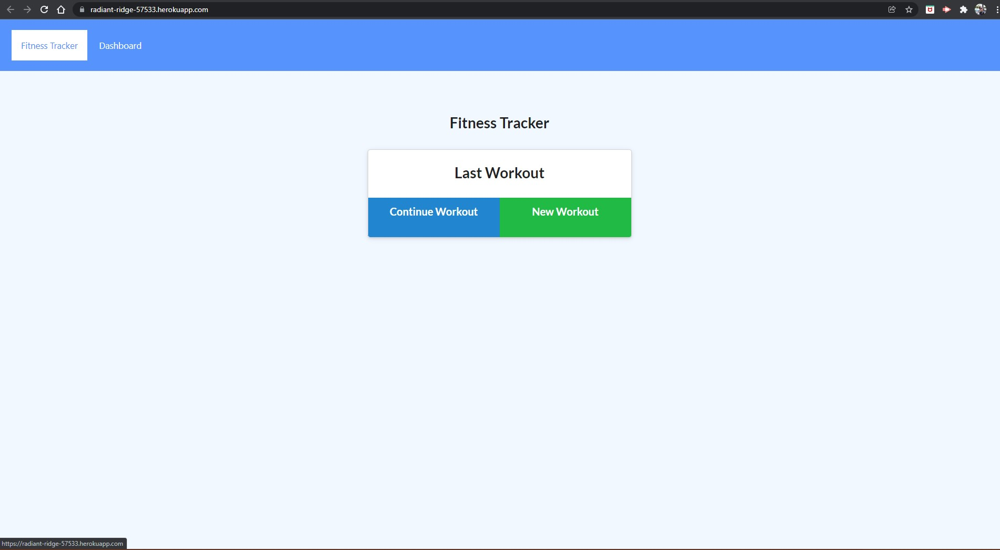
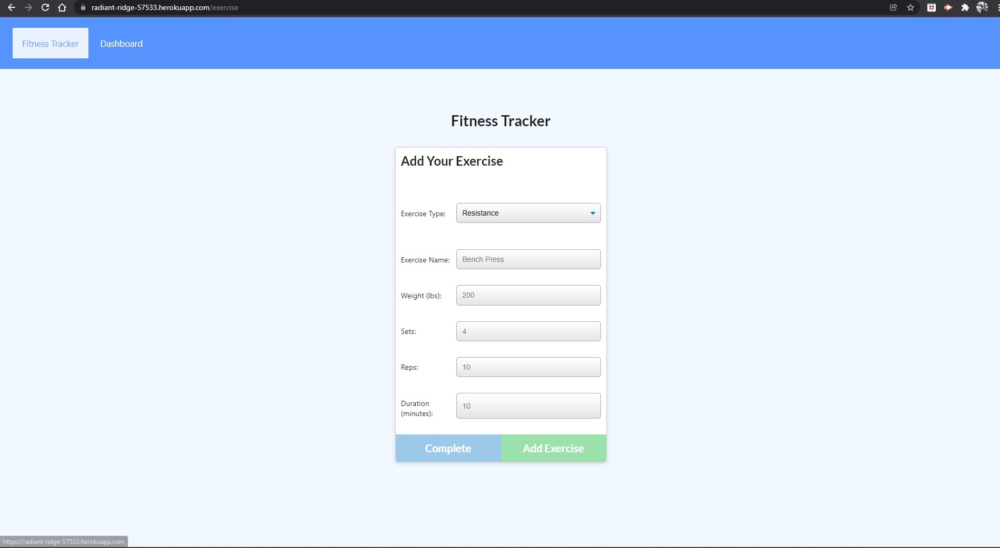
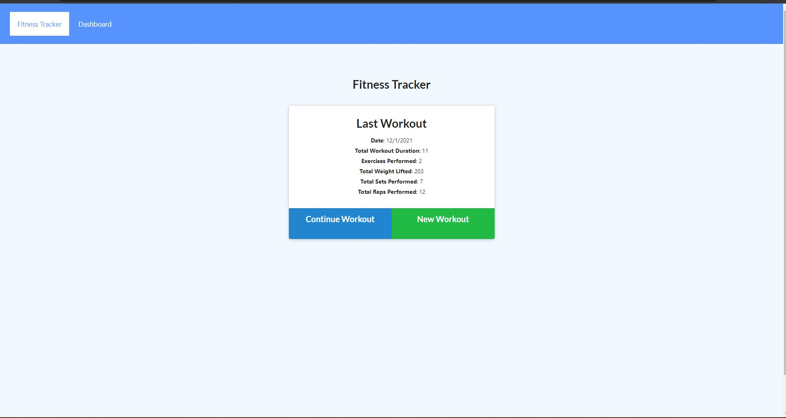

# Project_Title

FITNESS_KEEPER

## Description:

FITNESS_KEEPER is a workout application that creates and tracks daily workouts. This application allows you to log multiple exercises in each workout. You can track the name, type, weight, sets, reps, duration (and distance traveled for Cardio) of each exercise.

### Table of Contents

- [Project_Title](#project_title)
- [Desciption](#description)
- [Contributors](#contributors)
- [Installation](#installation)
- [Media](#media)

### Contributors

Alfonso Robles

#### Installation

-[Npm express] -[Nmp path]

#### Media

[FitnessKeeper link](https://radiant-ridge-57533.herokuapp.com/)

