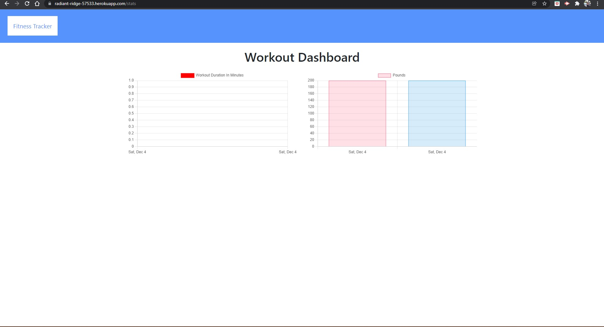

# FITNESS_KEEPER

### Table of Contents

- [Desciption](#description)
- [Contributors](#contributors)
- [Installation](#installation)
- [Technologies_Used](#technologies_used)
- [Media](#media)

## Description:

FITNESS_KEEPER is a workout application that creates and tracks daily workouts. This application allows you to log multiple exercises in each workout. You can track the name, type, weight, sets, reps, duration (and distance traveled for Cardio) of each exercise.
This application, built on the back-end utilizes MongoDB for its database and Express for the back-end framework.

### Contributors

Alfonso Robles

#### Installation

- `npm install`
- `npm start`

#### Technologies_Used

- MongoDB
- Express
- Morgan

#### Media

[FitnessKeeper](https://radiant-ridge-57533.herokuapp.com/)

